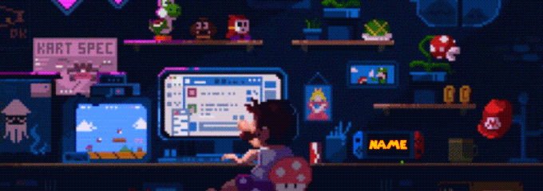

<h1 align="center">Vlad Omilescu</h1>

  <b>CS & Cybersecurity • Systems, Web, and a bit of Game Dev</b> 

  

---

### ⚡ What I Do
- Build fast, clean web apps (React / Next.js) and solid backends (SQL/Mongo).
- Low-level & systems-leaning work in **C/C++** and Linux.
- Automation, scripting, and data wrangling with **Python**.
- Networking fundamentals, Dockerized dev environments, and CI-friendly workflows.

---

### 🧰 Tech Stack

<table>
  <!-- ROW 1 -->
  <tr>
    <td width="33%" valign="top">
      <h3>💻 Programming Languages</h3>
      

        &nbsp;&nbsp;
        &nbsp;&nbsp;
        &nbsp;&nbsp;
        &nbsp;&nbsp;
        
      

    </td>
    <td width="33%" valign="top">
      <h3>🌐 Web Development</h3>
      

        &nbsp;&nbsp;
        &nbsp;&nbsp;
        &nbsp;&nbsp;
        
      

    </td>
    <td width="33%" valign="top">
      <h3>🗄️ Databases</h3>
      

        &nbsp;&nbsp;
        &nbsp;&nbsp;
        
      

    </td>
  </tr>

  <!-- ROW DIVIDER -->
  <tr>
    <td colspan="3">
</td>
  </tr>

  <!-- ROW 2 -->
  <tr>
    <td width="33%" valign="top">
      <h3>🔌 Embedded & Hardware</h3>
      

        
      

    </td>
    <td width="33%" valign="top">
      <h3>🛠️ Dev & Collaboration</h3>
      

        &nbsp;&nbsp;
        &nbsp;&nbsp;
        &nbsp;&nbsp;
        
      

    </td>
    <td width="33%" valign="top">
      <h3>⚙️ Frameworks / Platforms</h3>
      

        
      

    </td>
  </tr>
</table>

---

### 🚀 Featured Projects
- **Network Mission** — a 2D puzzle-adventure that teaches cryptography (GML + native C extensions via OpenSSL).  
- **Automated File System Organizer** — Python tool to keep directories sane.  
- **Interactive Web CV** — Single-page React resume with responsive UI.

---

### 📊 By-the-Numbers

  
  

---

### 📨 Reach Me
- Email: <a href="mailto:vlad.omilescu@gmail.com">vlad.omilescu@gmail.com</a>
- GitHub: <a href="https://github.com/omilescuvlad">omilescuvlad</a>
- LinkedIn: <a href="https://www.linkedin.com/in/omilescuvlad/">in/omilescuvlad</a>

 

<!-- Footer line -->

<i>Security is not about building walls, but about opening doors wisely.</i>

