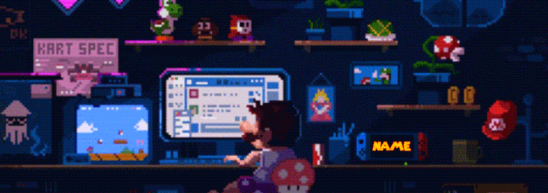

<h1 align="center">Vlad Omilescu</h1>

  <b>Backend Development • TypeScript • NestJS • PostgreSQL</b> 

  

---

### ⚡ What I Do
- Build structured backend APIs with **NestJS**, **TypeScript**, and **Node.js**.
- Design relational data models using **PostgreSQL** and **TypeORM**.
- Implement authentication and authorization flows with **JWT** and **bcrypt**.
- Containerize backend services with **Docker** and **Docker Compose**.
- Keep code maintainable with **ESLint**, **Prettier**, and automated testing with **Jest**.

---

### 🧰 Tech Stack

<table>
  <tr>
    <td width="33%" valign="top">
      <h3>💻 Languages & Runtime</h3>
      

        &nbsp;&nbsp;
        &nbsp;&nbsp;
        
      

    </td>
    <td width="33%" valign="top">
      <h3>⚙️ Backend Framework</h3>
      

        &nbsp;&nbsp;
        
      

    </td>
    <td width="33%" valign="top">
      <h3>🗄️ Database & ORM</h3>
      

        &nbsp;&nbsp;
        <b>TypeORM</b>
      

    </td>
  </tr>

  <tr>
    <td colspan="3">
      

    </td>
  </tr>

  <tr>
    <td width="33%" valign="top">
      <h3>🔐 Auth & Security</h3>
      

        <b>JWT</b>&nbsp;&nbsp;
        <b>bcrypt</b>&nbsp;&nbsp;
        <b>dotenv</b>
      

    </td>
    <td width="33%" valign="top">
      <h3>🧪 Testing & Quality</h3>
      

        &nbsp;&nbsp;
        &nbsp;&nbsp;
        <b>Prettier</b>
      

    </td>
    <td width="33%" valign="top">
      <h3>🐳 DevOps</h3>
      

        &nbsp;&nbsp;
        <b>Docker Compose</b>
      

    </td>
  </tr>
</table>

---

### 🚀 Featured Project
- **Pastebin API** — a backend API built with **NestJS**, **TypeScript**, **PostgreSQL**, and **TypeORM**, featuring authentication with **JWT**, password hashing with **bcrypt**, environment-based configuration, Dockerized services, and testing support with **Jest**.

---

### 📊 By-the-Numbers

  
  

---

### 📨 Reach Me
- Email: <a href="mailto:vlad.omilescu@gmail.com">vlad.omilescu@gmail.com</a>
- GitHub: <a href="https://github.com/omilescuvlad">omilescuvlad</a>
- LinkedIn: <a href="https://www.linkedin.com/in/omilescuvlad/">in/omilescuvlad</a>

 

<i>Clean APIs, typed code, and reliable backend systems.</i>

